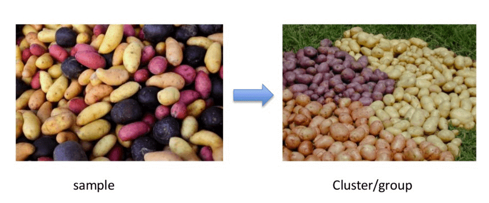
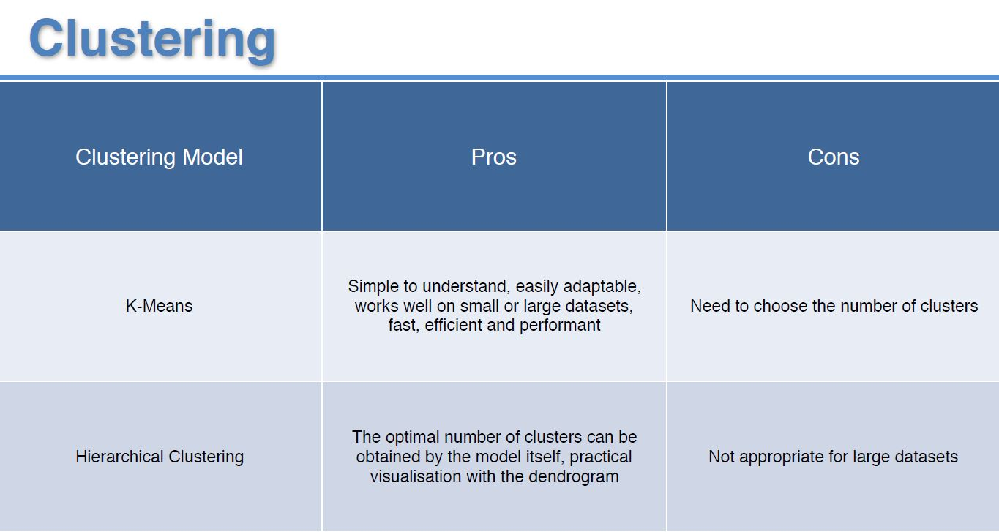

# Analysis-Customer-Personality-by-Using-Clustering-Methods
## Unsupervised Machine Learning
**Unsupervised Learning** is a machine learning technique in which the users do not need to supervise the model. Instead, it allows the model to work on its own to discover patterns and information that was previously undetected. It mainly deals with the unlabelled data.
**Unsupervised Learning Algorithms** allow users to perform more complex processing tasks compared to supervised learning. Although, unsupervised learning can be more unpredictable compared with other natural learning methods. Unsupervised learning algorithms include:
  Clustering 
  Anomaly Detection
  Neural Networks, etc.

#### Why Unsupervised Learning?
Here, are prime reasons for using Unsupervised Learning in Machine Learning:
  •		Unsupervised machine learning finds all kind of unknown patterns in data.
  •		Unsupervised methods help you to find features which can be useful for categorization.
  •		It is taken place in real time, so all the input data to be analyzed and labeled in the presence of learners.
  •		It is easier to get unlabeled data from a computer than labeled data, which needs manual intervention.
### Clustering

Clustering is defined as dividing data points or population into several groups such that similar data points are in the same groups. The aim to segregate groups based on similar traits. 
While carrying on an unsupervised learning task, the data you are provided with are not labeled. It means that your algorithm will aim at inferring the inner structure present within data, trying to group, or cluster, them into classes depending on similarities among them.
Clustering is an important concept when it comes to unsupervised learning. It mainly deals with finding a structure or pattern in a collection of uncategorized data. Unsupervised Learning Clustering algorithms will process your data and find natural clusters(groups) if they exist in the data. You can also modify how many clusters your algorithms should identify. It allows you to adjust the granularity of these groups.
#### Clustering Types
Following are the clustering types of Machine Learning which I’d like to build them up in this repository are:
  •		K-means
  •		Hierarchical clustering
#### Exclusive (partitioning)
In this clustering method, Data are grouped in such a way that one data can belong to one cluster only.
Example: **K-means**
### K-means Clustering
K means it is an iterative clustering algorithm which helps you to find the highest value for every iteration. Initially, the desired number of clusters are selected. In this clustering method, you need to cluster the data points into k groups. A larger k means smaller groups with more granularity in the same way. A lower k means larger groups with less granularity.
The output of the algorithm is a group of “labels.” It assigns data point to one of the k groups. In k-means clustering, each group is defined by creating a centroid for each group. The centroids are like the heart of the cluster, which captures the points closest to them and adds them to the cluster.
K-mean clustering further defines two subgroups:
•	Agglomerative clustering
•	Dendrogram
#### Agglomerative clustering
This type of K-means clustering starts with a fixed number of clusters. It allocates all data into the exact number of clusters. This clustering method does not require the number of clusters K as an input. Agglomeration process starts by forming each data as a single cluster.
This method uses some distance measure, reduces the number of clusters (one in each iteration) by merging process. Lastly, we have one big cluster that contains all the objects.
In this clustering technique, every data is a cluster. The iterative unions between the two nearest clusters reduce the number of clusters.
Example: **Hierarchical clustering**

#### Dendrogram
In the Dendrogram clustering method, each level will represent a possible cluster. The height of dendrogram shows the level of similarity between two join clusters. The closer to the bottom of the process they are more similar cluster which is finding of the group from dendrogram which is not natural and mostly subjective.

### Hierarchical Clustering
Hierarchical clustering is an algorithm which builds a hierarchy of clusters. It begins with all the data which is assigned to a cluster of their own. Here, two close cluster are going to be in the same cluster. This algorithm ends when there is only one cluster left.

### K-Means vs Hierarchical 
As we know, clustering is a subjective statistical analysis, and there is more than one appropriate algorithm for every dataset and type of problem. So how to choose between K-means and hierarchical?
  1.	If there is a specific number of clusters in the dataset, but the group they belong to is unknown, choose K-means. 
  2.	If the distinguishes are based on prior beliefs, hierarchical clustering should be used to know the number of clusters.
  3.	With a large number of variables, K-means compute faster. 
  4.	The result of K-means is unstructured, but that of hierarchal is more interpretable and informative. 
  5.	It is easier to determine the number of clusters by hierarchical clustering’s dendrogram
### Conclusion
The article discussed various ways of performing clustering. The applications of clustering are found in a large number of domains for unsupervised learning. Clustering can also be used to improve the accuracy of the supervised machine learning algorithm. Although it is easy to implement, some critical aspects needed to be taken care of like treating outliers in the data and ensuring that each cluster has a sufficient population. 

 
## Dataset Explanation:
### Context
### Problem Statement
Customer Personality Analysis is a detailed analysis of a company’s ideal customers. It helps a business to better understand its customers and makes it easier for them to modify products according to the specific needs, behaviors and concerns of different types of customers. 
Customer personality analysis helps a business to modify its product based on its target customers from different types of customer segments. For example, instead of spending money to market a new product to every customer in the company’s database, a company can analyze which customer segment is most likely to buy the product and then market the product only on that particular segment.
### Content
#### Attributes
  **People**
  •	ID: Customer's unique identifier
  •	Year_Birth: Customer's birth year
  •	Education: Customer's education level
  •	Marital_Status: Customer's marital status
  •	Income: Customer's yearly household income
  •	Kidhome: Number of children in customer's household
  •	Teenhome: Number of teenagers in customer's household
  •	Dt_Customer: Date of customer's enrollment with the company
  •	Recency: Number of days since customer's last purchase
  •	Complain: 1 if customer complained in the last 2 years, 0 otherwise
  **Products**
  •	MntWines: Amount spent on wine in last 2 years
  •	MntFruits: Amount spent on fruits in last 2 years
  •	MntMeatProducts: Amount spent on meat in last 2 years
  •	MntFishProducts: Amount spent on fish in last 2 years
  •	MntSweetProducts: Amount spent on sweets in last 2 years
  •	MntGoldProds: Amount spent on gold in last 2 years
  **Promotion**
  •	NumDealsPurchases: Number of purchases made with a discount
  •	AcceptedCmp1: 1 if customer accepted the offer in the 1st campaign, 0 otherwise
  •	AcceptedCmp2: 1 if customer accepted the offer in the 2nd campaign, 0 otherwise
  •	AcceptedCmp3: 1 if customer accepted the offer in the 3rd campaign, 0 otherwise
  •	AcceptedCmp4: 1 if customer accepted the offer in the 4th campaign, 0 otherwise
  •	AcceptedCmp5: 1 if customer accepted the offer in the 5th campaign, 0 otherwise
  •	Response: 1 if customer accepted the offer in the last campaign, 0 otherwise
  **Place**
  •	NumWebPurchases: Number of purchases made through the company’s web site
  •	NumCatalogPurchases: Number of purchases made using a catalogue
  •	NumStorePurchases: Number of purchases made directly in stores
  •	NumWebVisitsMonth: Number of visits to company’s web site in the last month
## Target
**Need to perform clustering to summarize customer segments.In this repository I clustered customer based on their consomption amount spent on meat and fruits in last 2 years **

